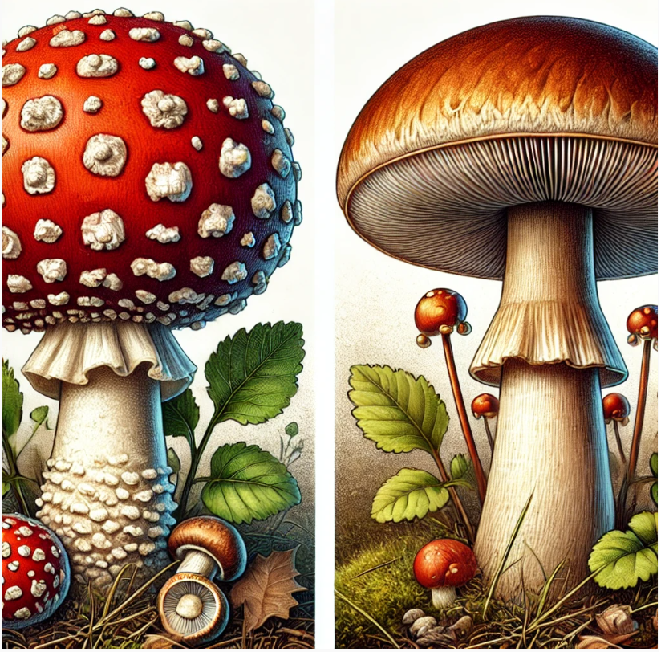

# Binary Mushroom Prediction: Kaggle Competition
In this project, I participated in the [Kaggle competition for the binary prediction of poisonous mushrooms](https://www.kaggle.com/competitions/playground-series-s4e8/), working with a dataset of approximately 3.12 million records from the [Kaggle dataset](https://www.kaggle.com/competitions/playground-series-s4e8/data) and around 60,000 records from [the UCI secondary mushroom dataset](https://archive.ics.uci.edu/dataset/848/secondary+mushroom+dataset). The dataset contained 20 features (3 numerical and 17 categorical) and 1 target class indicating whether a mushroom is poisonous or edible.

1. Exploratory Data Analysis (EDA) in **MushroomEDA.ipynb**:
This Jupyter notebook is dedicated to conducting an in-depth exploratory data analysis (EDA) of the mushroom dataset. It involves understanding the distribution of various features, identifying correlations, and spotting potential outliers. This step is crucial for gaining insights into the data and informing the feature engineering process that follows.

2. Solution Based on Class Data and Classifier in **BinaryMushroomPrediction.ipynb** :
This notebook provides a solution for predicting whether a mushroom is poisonous or edible. It includes:
* Data Handling: Preprocessing steps such as handling missing values, encoding categorical features, and scaling numerical data.
* Model Training: Training various classifiers like XGBoost, RandomForest, KNeighbors, DecisionTree, and Support Vector Machine on the preprocessed data.
* Prediction: Using the trained models to predict the class of mushrooms and evaluating the models' performance based on metrics such as accuracy, MCC, and others.

These notebooks together represent the complete workflow from data exploration to model training and prediction in the binary classification of mushrooms.

# Approach
Exploratory Data Analysis (EDA) and Feature Engineering Conducted thorough EDA to understand the distribution of features, correlations, and potential outliers.
Performed feature engineering to optimize the dataset for model training, including handling missing values, encoding categorical variables, and feature scaling where necessary.

# Model Training and Prediction
I experimented with several models, including:

1. XGBoost (XGB): The highest-performing model in my experiments, achieving a 0.98480 MCC on the public leaderboard, with an accuracy of around 0.993.
2. Stacked Models: Created a stack consisting of XGBoost, RandomForestClassifier, KNeighborsClassifier, DecisionTreeClassifier, and Support Vector Machine. This ensemble approach provided robust predictions but did not surpass the individual XGBoost model.
3. TensorFlow Deep Neural Network: Explored a deep learning approach, which performed well (MCC 0.9845),but less effective compared to XGBoost.
The models were trained using Kaggle's environment, which provided 4 CPU cores and dual NVIDIA T4 GPUs.

# Competition Results
* The winning entry achieved an MCC score of 0.98511.
* My best model, XGBoost, achieved an MCC score of 0.9480, placing me in the top 20% of participants.

# Lessons Learned
Upon reviewing top-performing solutions, I observed that high-ranking competitors often employed extensive model stacking and ensembling techniques. For example:

1. [6th Place Solution](https://www.kaggle.com/competitions/playground-series-s4e8/discussion/531330): Utilized a large ensemble of 25 models, selecting 13 through hill climbing for the final submission.
2. [3rd Place Solution](https://www.kaggle.com/competitions/playground-series-s4e8/discussion/523656): Leveraged AutoGluon with significant computational resources to achieve a top score.
3. [10th Place Solution](https://www.kaggle.com/code/ravaghi/s04e08-mushroom-classification-ensemble): same approach

# Future Strategy
In future competitions, I plan to adopt a similar approach, focusing on stacking a diverse array of models and exploring automated machine learning (AutoML) frameworks to improve performance and potentially reach a top leaderboard position.
